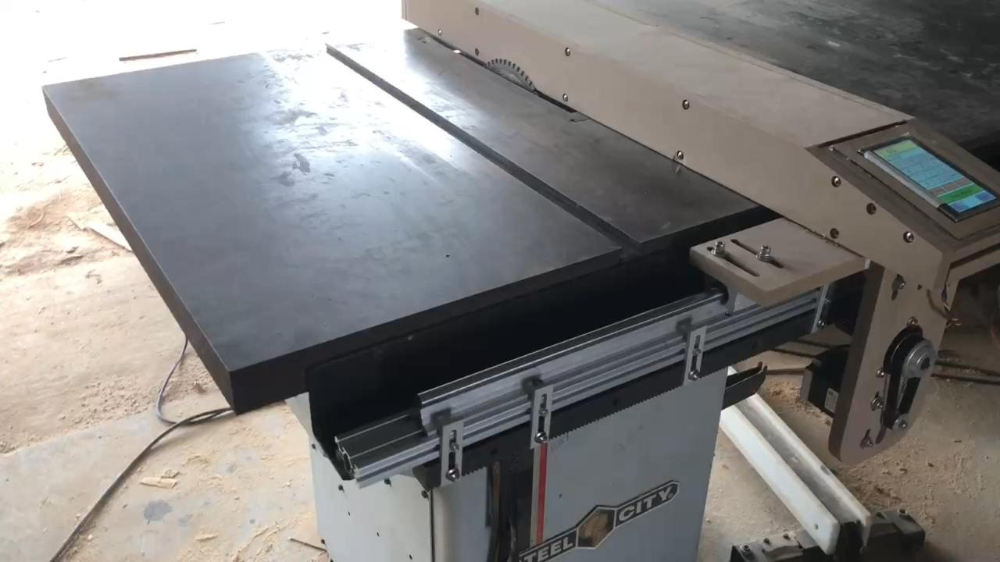
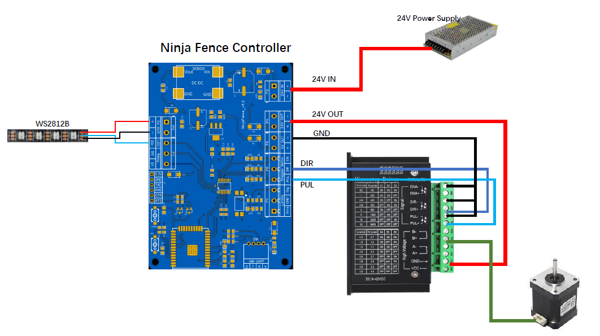

# NinjaFence Project

NinjaFence is a low-cost automated table saw fence controller. Table saws are one of the most commonly used woodworking machines, and being able to modify the table saw fence is very interesting for an engineer who loves woodworking, and this idea came out since 2018, the solution of hardware and software was changed many times intermittently, and finally designed this way for easier use and low cost.

---

# NinjaFence Feature list
* [x] One stepper motor control
* [x] Hardware/Software limit
* [x] LED Strip indicator(WS2812)
* [x] Jog+/Jog- (0.1mm)
* [x] Firmware OTA support
* [x] Fence calibration 
* [ ] Homing

# NinjaFence Hardware Interface

| Interface | Description |
|:-----|:-----|
| **24V IN**    | 24V power supply connector, __*12V~28V*__ |
| **24V OUT**   | It can supply power to the stepper motor driver  |
| **5V OUT**    | Can supply power to external devices |
| **EN**        | For stepper motor driver enable, __*we don't use this currently*__|
| **DIR** | For stepper motor driver direction |
| **PUL** | For stepper motor driver pulse |
| **Sig** | For limit signal, a __*HIGH*__ level signal will trigger fence stop |
| **Din** | Connect to WS2812 data in, MAX LED number is __*4*__ |
| **D0**  | Digital out 0, when ninjafence is moving, output __*HIGH*__ level |
| **D1**  | Digital out 1, when ninjafence is moving, output __*LOW*__ level |
| **HMI UART** | Connect to 4.3 inch touchscreen, __*V: 5V+, G: 5V-*__ |

# NinjaFence Wiring Diagram

# NinjaFence Touchscreen Interface

# NinjaFence Configuration Interface

