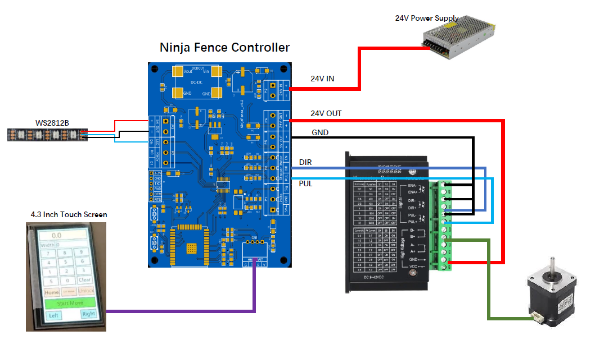

# NinjaFence Project

NinjaFence is a low-cost automated table saw fence controller. Table saws are one of the most commonly used woodworking machines, and being able to modify the table saw fence is very interesting for an engineer who loves woodworking, and this idea came out since 2018, the solution of hardware and software was changed many times intermittently, and finally designed this way for easier use and low cost.

Any issues or feature requests, please let me know and I will continue to improve. Thanks.

---

# NinjaFence Video

---

# NinjaFence Feature list
* [x] One stepper motor control
* [x] Hardware/Software limit
* [x] LED Strip indicator(WS2812)
* [x] Jog+/Jog- (0.1mm)
* [x] Firmware OTA support
* [x] Fence calibration 
* [ ] Homing

---

# NinjaFence Hardware Interface

| Interface | Description |
|:-----|:-----|
| **24V IN**    | 24V power supply connector, __*12V~28V*__ |
| **24V OUT**   | It can supply power to the stepper motor driver  |
| **5V OUT**    | Can supply power to external devices |
| **EN**        | For stepper motor driver enable, __*we don't use this currently*__|
| **DIR** | For stepper motor driver direction |
| **PUL** | For stepper motor driver pulse |
| **Sig** | For limit signal, a __*HIGH*__ level signal will trigger fence stop |
| **Din** | Connect to WS2812 data in, MAX LED number is __*4*__ |
| **D0**  | Digital out 0, when ninjafence is moving, output __*HIGH*__ level |
| **D1**  | Digital out 1, when ninjafence is moving, output __*LOW*__ level |
| **HMI UART** | Connect to 4.3 inch touchscreen, __*V: 5V+, G: 5V-*__ |

---

# NinjaFence Wiring Diagram

---

---

# NinjaFence LED Indicator

* Solid Green: NinjaFence is moving.
* Blinking Yellow: NinjaFence is idle.
* Blinking Red: There has error, use __**Unlock**__ to clear the error.

---

# NinjaFence 4.3 inch Touchscreen Interface

---

# NinjaFence Configuration Interface

Ninjafence have a tiny web interface to configure some machine parameters.
For the first setup your table saw fence, you may need to set some parameters which
depends on your machine.

When power on NinjaFence, you can scan the wifi device named by __**"NinjaFence"**__ through
cellphone or tablet or PC. The wifi password is __**"ninjafence"**__, then open your web browser, try to input the website __**"192.168.0.1"**__ or __**"ninjafence.local"**__, and finally you will see this web interface:

There have some main functions through NinjaFence web interface:
* NinjaFence Configuration
* NinjaFence Calibration
* NinjaFence Default Configuration
* NinjaFence OTA
* NinjaFence Test

#### NinjaFence Configuration

This block contains the stepper motor pulse, stepper motor speed and stepper motor acceleration.
The most important parameter is the stepper motor pulse, this parameter depends on your machine, you can use ball screws or rack and pinion to build your machine. 
The easy way to configure stepper motor pulse is to use the **NinjaFence Calibration**.

#### NinjaFence Calibration

This block is to get the stepper motor pulse. 

Calibration Steps:
1. Mark the current position of the fence.
2. Click the button __**"Move"**__.
3. Wait for the fence move to complete, if there is an emergency, turn off the power immediately.
4. Measure the actual movement and set the movement(mm) to __**"Actual movement"**__.
5. Click the button __**"Calcuulate"**__. and then you will get the actual stepper motor pulse.
6. Set this result to __**"Stepper Pulse"**__ in the block __**"NinjaFence Configuration"**__.

__**Note:**__
Before use this function, you must keep the table of your table saw clean and put away the saw blade. The default movement for calibration is **100 mm**.

The stepper motor pulse greater than 200 is beffer, this means that 1 stepper motor pulse can move 1/pulse mm, can get more precise movements.

#### NinjaFence  Default Configuration

* Default Pulse: 256. This means that move 1mm need 256 pulse.
* Default Driver Pulse/rev: 6400. This means that 6400 steps per circle.
* Default MAX Movement limit(mm): 1500. There has a soft limit, the maximum movement of NinjaFence is 1.5m.

#### NinjaFence OTA

This block is to update NinjaFence firmware.

---

# Developer Information

* Github repository: https://github.com/ninjafence/ninjafence

# Amazon link

* https://www.amazon.com/dp/B0D41JLJ99
